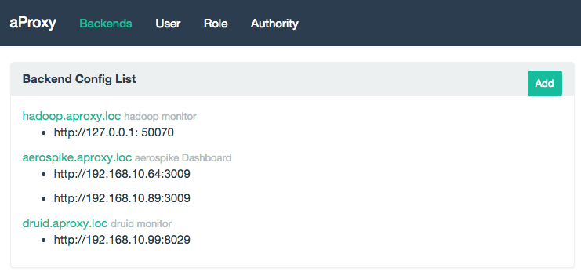
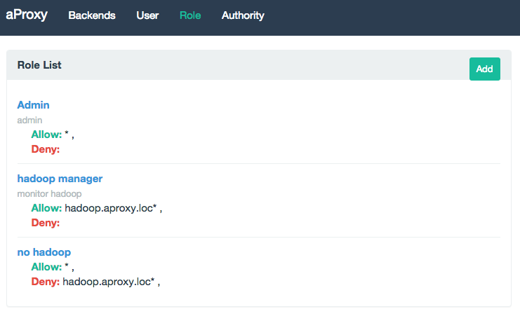
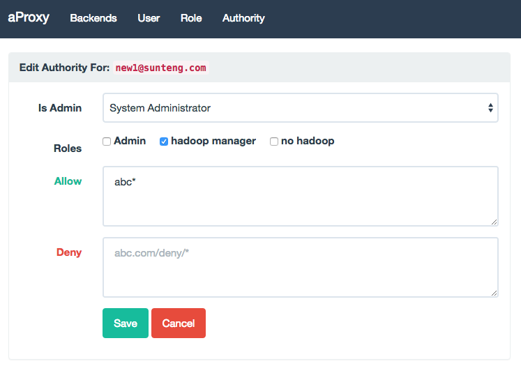

# aproxy

`aproxy` is a reverse proxy that include authentication. It design to protect the resources that you want to expose, but only allow some one has you permission to access.

## Screenshot






## Install

### Install from source

```
cd $GOPATH
git clone https://github.com/shunfei/aproxy.git
cd aproxy
go build -o bin/aproxy bin/aproxy.go
go build -o bin/adduser bin/adduser.go
```

## Run

Before running, your must change the config in `conf/aproxy.toml`.

```
./bin/aproxy -c conf/aproxy.toml
```

By now there is no users in the database, so let me add a user:

```
./bin/adduser -c conf/aproxy.toml -action adduser -email yourname@gmail.com -pwd passwordxxx
```

And the user added above do not have admin permission, so let me set it to admin.

```
./bin/adduser -c conf/aproxy.toml -action setadmin -email yourname@gmail.com -adminlevel 99
```

And now you can visit `http://127.0.0.1:8098/-_-aproxy-_-/` and config your aproxy.

## Config

 `conf/aproxy.toml` 

## Nginx Config Example

